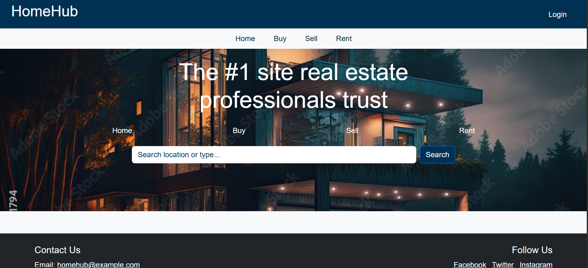
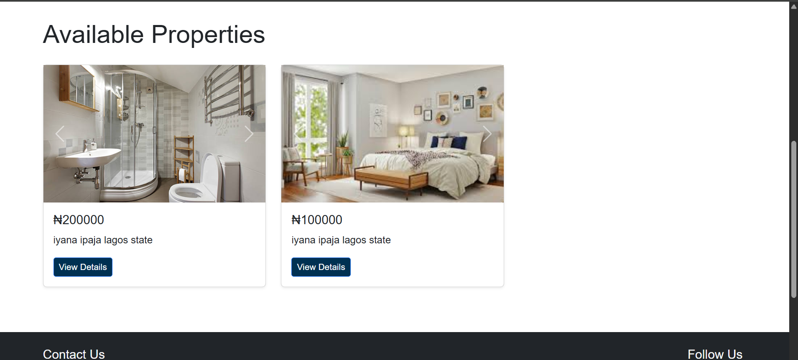
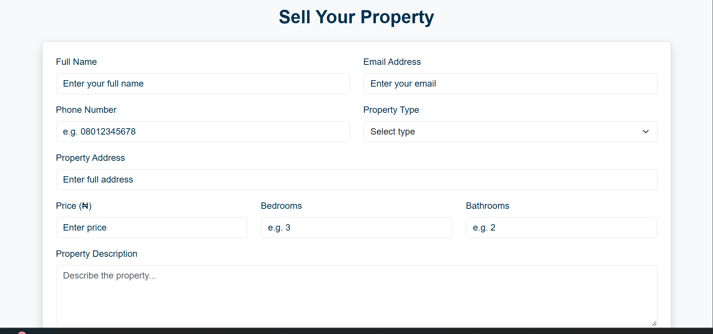
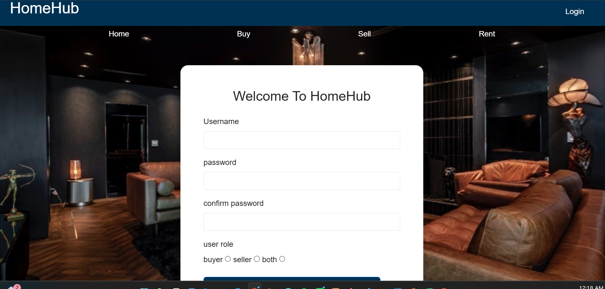

# HomeHub

A responsive real estate website built with Python, Flask, HTML5, CSS3, and Bootstrap. HomeHub gives users a simple, clean interface for exploring real estate opportunities, with pages for buying, selling, and renting properties.

This was my first project built with Python, made to practice Flask, databases, and responsive web design.

## Features

- Responsive design for desktop, tablet, and mobile
- Home page with navigation to other sections
- User registration and login
- Buy page for browsing properties
- Sell page for listing properties
- Rent page for browsing rentals and uploading houses for rent
- Clean, simple interface built with Bootstrap
- Flask backend
- SQLite database

## Technologies Used

- Python
- Flask
- HTML5, CSS3
- Bootstrap
- SQLite
- SQLAlchemy

## Project Structure

```text
HomeHub/
│── app.py
│── requirements.txt
│── database.db
│── static/
│── templates/
│   ├── home.html
│   ├── login.html
│   ├── register.html
│   ├── buy.html
│   ├── sell.html
│   └── rent.html
│── screenshots/
└── README.md
```

## Getting Started

1. Clone the repository
   ```bash
   git clone https://github.com/zeekahlawrence/homehub.git
   cd homehub
   ```

2. Create and activate a virtual environment
   ```bash
   python -m venv venv
   venv\Scripts\activate      # Windows
   source venv/bin/activate   # macOS/Linux
   ```

3. Install dependencies
   ```bash
   pip install -r requirements.txt
   ```

4. Run the app
   ```bash
   python app.py
   ```

5. Open the URL Flask gives you in your browser.

## Screenshots

Add your images to the `screenshots/` folder and they'll show up here.






## What I Learned

- Flask routing and Jinja templates
- Form handling
- Responsive design with Bootstrap
- SQLite and SQLAlchemy basics
- Connecting a backend to a database
- Organizing a web app project

## Future Improvements

- Property search and filtering
- Property favorites
- User and admin dashboards
- Deploy the app online

## Disclaimer

Built for learning and portfolio purposes, not production use.

## Author

**Ngozika Ezeigbo**
Computer Science Student | Web Developer
GitHub: [@zeekahlawrence](https://github.com/zeekahlawrence)
